

  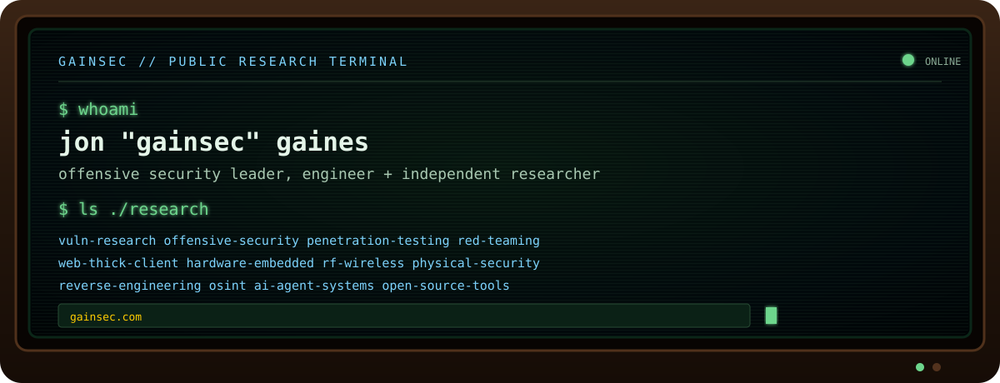

  <a href="#research-projects-with-github-repos">Research Projects</a> ·
  <a href="#featured-projects">Featured Projects</a> ·
  <a href="#project-card-archive">All Project Cards</a> ·
  <a href="#project-constellation">Project Constellation</a> ·
  <a href="#complete-atlas">Complete Atlas</a>

**GainSec is the personal handle/brand of Jon “GainSec” Gaines—an offensive security leader, engineer, and independent researcher.** The public archive spans vulnerability research and disclosure; offensive-security tooling; web, software, thick-client, macOS, mobile, and cloud security; hardware, embedded/IoT, RF/wireless, cellular/V2X, physical-security, and surveillance systems; reverse engineering, OSINT, and LLM/ML/AI/agent systems. It also includes open-source applications and utilities, robotics, data visualization, technical walkthroughs, publications, leadership writing, and experimental engineering.

Further research, technical write-ups, commentary, and other posts can be found at [GainSec.com](https://gainsec.com/).

This page was last updated 09/2026.

## Research Projects with GitHub Repos

### Connected Public Safety and Anti-Crime Technology

- **Flock Safety Security Vulnerabilities:** [Examining the Security Posture of an Anti-Crime Ecosystem](https://github.com/GainSec/anti-crime-ecosystem-research) is a versioned whitepaper and disclosure archive covering >50 vulnerabilities I found in Flock Safety's gunshot detection, license-plate reader, and compute hardware, with defender guidance and repository-maintained finding/CVE accounting.
- **Flock Safety Offensive Security Tooling:** [BirdShot](https://github.com/GainSec/BirdShot) is an offline-first offensive framework for authorized Flock Safety security assessments and penetration testing; [Trap Shooter / Sniffer / Alarm](https://github.com/GainSec/Flock-Safety-Trap-Shooter-Sniffer-Alarm) detects nearby Flock-related Wi-Fi activity; and the [Falcon/Sparrow EDL firehose](https://github.com/GainSec/flock-safety-falcon-sparrow-alpr-edl-firehose) provides EDL-mode interaction tooling for researched ALPR hardware.
- **Verkada Security Vulnerabilities:** [Verkracked](https://gainsec.com/2026/09/06/verkracked-security-research-on-verkada-anti-crime-devices-part-0/) is an ongoing independent security research project examining owned Verkada hardware. Public companion releases currently include a [local cloud framework for Verkada alarm hubs](https://github.com/GainSec/verkada-verkracked-alarm-hub-local-framework) and a [Sub-GHz interoperability framework](https://github.com/GainSec/verkada-verkracked-subghz-framework). Parts 1–3 are scheduled for public disclosure on December 5, 2026.
- **Digital Ally / Uniview:** the [ThermoVu / Uniview security research](https://github.com/GainSec/DigitalAlly-ThermoVu-Uniview-Security-Research) is accompanied by the [Uniview LAPI Research Toolkit](https://github.com/GainSec/Uniview-LAPI-Research-Toolkit), [ONVIF enumeration](https://github.com/GainSec/onvif-enum), and the [TensorFlow generic harness](https://github.com/GainSec/tensorflow-generic-harness) used for OEM-style model-pipeline replay.
- **Connected infrastructure:** [Tridium Niagara CVE PoCs](https://github.com/GainSec/CVE-2017-16744-and-CVE-2017-16748-Tridium-Niagara) preserve proofs of concept for CVE-2017-16744 and CVE-2017-16748.
- **Vehicle and V2X material:** [Phrack 72 V2X companion artifacts](https://github.com/GainSec/Phrack-72-Raw-Output-V2X) preserve raw output and logs accompanying my paper that was published in Phrack 72.

### Other Security Research

- [macOS Printer Simulator Security Research](https://github.com/GainSec/macos-printer-simulator-security-research) — Public disclosure documenting three validated technical weaknesses with reproduction source, evidence, current Low/Low/Informational ratings, and Apple’s recorded disposition.
- [AutoPro / Mayton CarPlay adapter research](https://github.com/GainSec/3rdParty-Carplay-AndroidAuto-Dongle-Security-Research) — Public wireless CarPlay adapter analysis, findings, evidence, source tools, and the first C2 for aftermarket Android Auto / Apple CarPlay dongles.
- [AOL Desktop Gold Security Research](https://github.com/GainSec/AOL-Desktop-Gold-Security-Research) — Independent group security research release covering a handful of vulnerabilities found in AOL Desktop Gold.
- [Little Tikes Dream Machine reverse engineering](https://github.com/GainSec/Little-Tikes-DreamProjector-Reverse-Engineering) — Notes and material from reverse engineering the Little Tikes Dream Machine.

### Beyond GitHub

The following incomplete list extends the GitHub record with security research, vulnerability disclosures, technical walkthroughs, leadership writing, papers, talks, and media published on [GainSec.com](https://gainsec.com/) or in external publications.

<!-- AUTO:RESEARCH START -->

<strong>Flock Safety Research · 12 publications</strong>

- **2026-09-17** — [Bird Hunting Season: Molting](https://gainsec.com/2026/09/17/bird-hunting-season-molting/)
- **2026-08-09** — [Bird Hunting Season at Def Con 34](https://gainsec.com/2026/08/09/bird-hunting-season-at-def-con-34/) — [Companion PDF for my DEF CON 34 Main Stage talk](https://media.defcon.org/DEF%20CON%2034/DEF%20CON%2034%20presentations/DEF%20CON%2034%20presentations/DEF%20CON%2034%20-%20Jon%20Gaines%20-%20Bird%20Hunting%20Season%20The%20Final%20Flight%20-%20PDF%20v1.pdf), covering 55 vulnerabilities I found in Flock Safety’s hardware ecosystem.
- **2026-01-09** — [Finding 67 Flock Safety Live PTZ Camera/LPR Feeds and Debug Web Interfaces accidentally exposed without authentication to the internet](https://gainsec.com/2026/01/09/bird-hunting-season-finding-67-live-camera-feeds-and-debug-web-interfaces-accidentally-exposed-by-flock-safety/)
- **2025-11-12** — [BirdEye](https://gainsec.com/2025/11/12/birdeye/)
- **2025-11-05** — [Formalizing my Flock Safety Security Research.](https://gainsec.com/2025/11/05/formalizing-my-flock-safety-security-research/)
- **2025-09-27** — [Button Presses to Wireless RCE:  Shell on Flock Safety’s License Plate Cameras Over Wi-Fi](https://gainsec.com/2025/09/27/button-presses-to-shell-on-flock-safety-license-plate-cameras-over-wi-fi/)
- **2025-09-27** — [Fly-By – Device 2: The Falcon/Sparrow – Gated Wireless RCE, Camera Feed, DoS, Information Disclosure and More](https://gainsec.com/2025/09/27/fly-by-device-2-the-falcon-sparrow-gated-wireless-rce-camera-feed-dos-information-disclosure-and-more/)
- **2025-09-19** — [Root from the Coop – Device 3: Root Shell on Flock Safety’s Picard/Bravo Compute Box](https://gainsec.com/2025/09/19/root-from-the-coop-device-3-root-shell-on-flock-safetys-bravo-compute-box/)
- **2025-06-30** — [Trap Shooter – Flock Safety Sniffer &amp; Alarm](https://gainsec.com/2025/06/30/trap-shooter-tiny-flock-safety-sniffer-alarm/)
- **2025-06-19** — [Grounded Flight – Device 2: Root Shell on Flock Safety’s Falcon/Sparrow Automated License Plate Reader](https://gainsec.com/2025/06/19/grounded-flight-device-2-root-shell-on-flock-safetys-falcon-sparrow-automated-license-plate-reader/)
- **2025-06-19** — [Plucked and Rooted – Device 1: Debug Shell on Flock Safety’s Raven Gunshot Detection System](https://gainsec.com/2025/06/19/plucked-and-rooted-device-1-debug-shell-on-flock-safetys-raven-gunshot-detection-system/)
- **2025-06-19** — [Bird Hunting Season – Security Research on Flock Safety’s Anti-Crime Systems](https://gainsec.com/2025/06/19/bird-hunting-season-security-research-on-flock-safety-anti-crime-systems/)

<strong>Verkada / Verkracked Research · 2 publications</strong>

- **2026-09-06** — [Verkracked Parts 4 &amp; 5 – Local Cloud and Sub-GHz Frameworks for Verkada Alarm Hubs](https://gainsec.com/2026/09/06/verkracked-parts-4-5-local-cloud-and-sub-ghz-frameworks-for-verkada-alarm-hubs/)
- **2026-09-06** — [Verkracked – Security Research on Verkada Anti-Crime Devices – Part 0](https://gainsec.com/2026/09/06/verkracked-security-research-on-verkada-anti-crime-devices-part-0/)

<strong>Other Connected Public Safety + Surveillance Research · 1 publication</strong>

- **2026-07-02** — [Digital Ally ThermoVu DTM-600 / Uniview LAPI Security Research Release](https://gainsec.com/2026/07/02/digital-ally-thermovu-dtm-600-uniview-lapi-security-research-release/)

<strong>Automotive, V2X + Connected Infrastructure · 3 publications</strong>

- **2026-07-02** — [AutoPro and 3rd Party Carplay/Android Auto Dongle Security Research](https://gainsec.com/2026/07/02/autopro-and-3rd-party-carplay-android-auto-dongle-security-research/)
- **2025-09-03** — [Roadside to Everyone – Intelligent Traffic Systems (ITS) Research – Kapsch TrafficCom AG (C)V2X Roadside Units (RSU)](https://gainsec.com/2025/09/03/roadside-to-everyone-intelligent-traffic-systems-its-research-kapsch-trafficcom-ag-cv2x-roadside-units-rsu/) — [Paper published in Phrack 72](https://phrack.org/issues/72/16_md)
- **2019-09-13** — [PoC for CVE-2017-16744 and CVE-2017-16748](https://gainsec.com/2019/09/13/poc-for-cve-2017-16744-and-cve-2017-16748/)

<strong>Hardware + Embedded Security · 4 publications</strong>

- **2025-05-25** — [Reverse Engineering the Little Tikes Dream Machine Projector – Part 1](https://gainsec.com/2025/05/25/reverse-engineering-the-little-tikes-dream-machine-projector-part-1/)
- **2025-04-01** — [Reverse engineering the MISIRUN Instant Print Kids Camera](https://gainsec.com/2025/04/01/reverse-engineering-kids-instaprint-camera/)
- **2025-02-27** — [CVE-2025-25727,CVE-2025-25728,CVE-2025-25729 Multiple Vulnerabilities found in BossComm OBD2 Tablet](https://gainsec.com/2025/02/27/cve-2025-25727cve-2025-25728cve-2025-25729-multiple-vulnerabilities-found-in-bosscomm-obd2-tablet/)
- **2025-02-27** — [CVE-2025-25730 Developer Options and USB Debugging Authorization Bypass in Motorola Droid Razr HD (XT926)](https://gainsec.com/2025/02/27/cve-2025-25730-developer-options-and-usb-debugging-authorization-bypass/)

<strong>Software Vulnerability Disclosures · 9 publications</strong>

- **2026-07-14** — [AOL Desktop Gold Security Research Public Release](https://gainsec.com/2026/07/14/aol-desktop-gold-security-research-public-release/)
- **2024-04-28** — [CVE-2024-32210, CVE-2024-32211, CVE-2024-32212, CVE-2024-32213 LoMag (Integrator/CE) WareHouse Management](https://gainsec.com/2024/04/28/cve-2024-32210-cve-2024-32211-cve-2024-32212-cve-2024-32213-lomag-integrator-ce-warehouse-management/)
- **2022-08-26** — [CVE-2022-34108, CVE-2022-34109, CVE-2022-34110 DoS + Arbitrary file Download/Copy in MSI Feature Navigator](https://gainsec.com/2022/08/26/cve-2022-34109-cve-2022-34110-cve-2022-34108/)
- **2022-08-19** — [CVE-2022-34615, CVE-2022-34621, CVE-2022-34623, CVE-2022-34624 – IDOR, User Enum and More (In Mealie)](https://gainsec.com/2022/08/19/cve-2022-34615-cve-2022-34621-cve-2022-34623-cve-2022-34624/)
- **2022-08-07** — [CVE-2022-37857, CVE-2022-37163, CVE-2022-37164 Hardcoded Credentials/Weak Password Policies](https://gainsec.com/2022/08/07/cve-2022-hardcoded-creds-weak-password-hauk-android-location-sharing/)
- **2022-08-04** — [CVE-2022-35142, CVE-2022-35143, CVE-2022-35144 – DoS, XSS and Weak Password Policy in Renato a Markdown powered knowledge base](https://gainsec.com/2022/08/04/cve-2022-35142-cve-2022-35143-cve-2022-35144/)
- **2022-08-02** — [CVE-2022-34613, CVE-2022-34618, CVE-2022-34619 – Multiple XSS (And more) in Mealie](https://gainsec.com/2022/08/02/cve-2022-34613-cve-2022-34618-cve-2022-34619-xss-file-upload-and-more/)
- **2022-08-02** — [CVE-2022-34625 – Server-Side Template Injection to Remote Code Execution (SSTI) to (RCE) in Mealie – A lesson in patience](https://gainsec.com/2022/08/02/cve-2022-34625-ssti-rce-mealie/)
- **2022-07-27** — [CVE-2022-34009](https://gainsec.com/2022/07/27/cve-2022-34009/)

<strong>OSINT Research · 4 publications</strong>

- **2026-09-17** — [Government Run OSINT Services](https://gainsec.com/2026/09/17/government-run-osint-services/) — [SectorGov](https://sectorgov.com/), a public directory for discovering government service links.
- **2023-01-03** — [10 Minutes of Google dorking for Covid Documents](https://gainsec.com/2023/01/03/10-minutes-of-google-dorking-for-covid-documents/) — [Article published in UNREDACTED Magazine, Issue 5 (2023)](https://inteltechniques.com/issues/005.pdf)
- **2020-09-06** — [OSINT Escapades #1 Government Run People Search](https://gainsec.com/2020/09/06/osint-escapades-1-government-run-people-search/)
- **2019-09-11** — [Government Run People Search Tools](https://gainsec.com/2019/09/11/government-run-people-search-tools/)

<strong>Technical Walkthroughs · 45 publications</strong>

- **2025-10-18** — [Addition to the $150 Private LTE Network](https://gainsec.com/2025/10/18/addition-to-the-150-private-lte-network/)
- **2025-10-08** — [Setting up your own 4G LTE Network (&lt;$150) for your Embedded System &amp; IoT Hacking Lab via Open5GS + CBRS eNodeB on Ubuntu 24.04](https://gainsec.com/2025/10/08/setting-up-your-own-4g-lte-network-150-for-your-embedded-system-iot-hacking-lab-via-open5gs-cbrs-enodeb-on-ubuntu-24-04/)
- **2025-06-26** — [Unbricking and Flashing the Yardstick One](https://gainsec.com/2025/06/26/unbricking-and-flashing-the-yardstick-one/)
- **2025-06-09** — [The quickest and simplest guide to spinning up a powerful local AI stack. Part 7 – Current Stack – Docker Deploy](https://gainsec.com/2025/06/09/the-quickest-and-simplest-guide-to-spinning-up-a-powerful-local-ai-stack-part-7-current-stack-docker-deploy/)
- **2025-06-08** — [The quickest and simplest guide to spinning up a powerful local AI stack. Part 6 – Open-WebUI To Crawl4AI – Chat](https://gainsec.com/2025/06/08/the-quickest-and-simplest-guide-to-spinning-up-a-powerful-local-ai-stack-part-6-open-webui-to-crawl4ai-chat/)
- **2025-06-07** — [The quickest and simplest guide to spinning up a powerful local AI stack. Part 5 – Open-WebUI To Crawl4AI – Local Files](https://gainsec.com/2025/06/07/the-quickest-and-simplest-guide-to-spinning-up-a-powerful-local-ai-stack-part-5-open-webui-to-crawl4ai-local-files/)
- **2025-06-04** — [The quickest and simplest guide to spinning up a powerful local AI stack. Part 4 – Transcription via Whisper](https://gainsec.com/2025/06/04/the-quickest-and-simplest-guide-to-spinning-up-a-powerful-local-ai-stack-part-4-transcription-via-whisper/)
- **2025-06-03** — [The quickest and simplest guide to spinning up a powerful local AI stack. Part 3 – Image Generation via Stable Diffusion](https://gainsec.com/2025/06/03/the-quickest-and-simplest-guide-to-spinning-up-a-powerful-local-ai-stack-part-3-image-generation-via-stable-diffusion/)
- **2025-06-02** — [The quickest and simplest guide to spinning up a powerful local AI stack. Part 2 – SearXNG](https://gainsec.com/2025/06/02/the-quickest-and-simplest-guide-to-spinning-up-a-powerful-local-ai-stack-part-2-searxng/)
- **2025-06-01** — [The quickest and simplest guide to spinning up a powerful local AI stack. Part 1](https://gainsec.com/2025/06/01/the-quickest-and-simplest-guide-to-spinning-up-a-powerful-local-ai-stack-part-1/)
- **2025-05-31** — [How to generate *VALID* TLS Certificates that are *NOT* self-signed for internal only services.](https://gainsec.com/2025/05/31/how-to-generate-valid-tls-certificates-that-are-not-self-signed-for-internal-only-services/)
- **2025-05-31** — [Complete Install Guide of Kali NetHunter on Nexus 6P – 2025](https://gainsec.com/2025/05/31/complete-install-guide-of-kali-nethunter-on-nexus-6p-2025/)
- **2025-05-28** — [Using a Nexus 6P and QCSuper to Sniff LTE.](https://gainsec.com/2025/05/28/using-a-nexus-6p-and-qcsuper-to-sniff-lte/)
- **2025-04-28** — [Unbricking and Reflashing the Ubertooth One Clones](https://gainsec.com/2025/04/28/fixing-unbricking-reflashing-ubertooth-one-clones/)
- **2025-04-17** — [PaxCounter (WiFi &amp; Bluetooth Device Counter) For the M5Stack Core2](https://gainsec.com/2025/04/17/m5stack-core2-paxcounter-wifi-bluetooth-device-counter/)
- **2025-03-13** — [Dumping Firmware from ESP8684](https://gainsec.com/2025/03/13/dumping-firmware-from-esp8684/)
- **2025-01-25** — [Sniffing V2X/DSRC with LibreSDR B210/B220 AD9361 on Linux](https://gainsec.com/2025/01/25/sniffing-v2x-dsrc-with-libresdr-b210-b220-ad9361-on-linux/)
- **2025-01-23** — [Setting up and configuring LibreSDR B210/B220 AD9361 on Windows and Linux](https://gainsec.com/2025/01/23/setting-up-and-configuring-libresdr-b210-b220-ad9361-on-windows-and-linux/)
- **2025-01-23** — [ConfiguringWindows Subsystem Linux (WSL) to access USB devices.](https://gainsec.com/2025/01/23/configuringwindows-subsystem-linux-wsl-to-access-usb-devices/)
- **2024-08-13** — [Sniffing Zigbee Traffic Easily  with the M5NanoC6 2024](https://gainsec.com/2024/08/13/m5nanoc6-zigbee-sniffer/)
- **2023-12-21** — [New Project: The Hackers Lunch Box](https://gainsec.com/2023/12/21/the-hackers-lunchbox/)
- **2022-05-02** — [How to Find the next BIG Data Leak in under 20 minutes or less! – LeakLooker-X – Updated 2022](https://gainsec.com/2022/05/02/how-to-find-the-next-big-data-leak-in-under-20-minutes-or-less-updated-2022/)
- **2022-03-11** — [How to install Veracrypt on Kali Linux](https://gainsec.com/2022/03/11/how-to-install-veracrypt-on-kali-linux/)
- **2022-03-07** — [Using the WayBack Machine to create parameter wordlists](https://gainsec.com/2022/03/07/internet-archive-wayback-machine-wordlist/)
- **2022-02-23** — [Check Host Information such as open ports from Shodan WITHOUT an API key!](https://gainsec.com/2022/02/23/shodan-port-information-without-api-key/)
- **2022-02-17** — [How to pipe terminal output to your clipboard! (And Vice Versa)](https://gainsec.com/2022/02/17/terminal-to-clipboard/)
- **2022-02-01** — [Change Virtualbox settings without booting and install Guest additions Kali Linux 2022](https://gainsec.com/2022/02/01/virtualbox-guest-additions-scale-kali-linux-2022/)
- **2022-01-30** — [Install and access Cassandra DB on Kali Linux with CLI client](https://gainsec.com/2022/01/30/gainsec-cassandra-db-kali-linux-cli-client/)
- **2022-01-28** — [Install MongoDB CLI Client on Kali Linux](https://gainsec.com/2022/01/28/mongodb-cli-client-kali-linux/)
- **2022-01-26** — [Install ProtonVPN on Kali Linux](https://gainsec.com/2022/01/26/protonvpn-kali-linux/)
- **2022-01-02** — [Top 5 ways to harden the security and privacy of your online accounts in 2022](https://gainsec.com/2022/01/02/top-5-ways-to-harden-the-security-and-privacy-of-your-online-accounts-in-2022/)
- **2021-11-06** — [Install Kali NetHunter Nexus 6p Android 8.1 2021](https://gainsec.com/2021/11/06/install-kali-nethunter-nexus-6p-android-8-1-2021/)
- **2021-09-14** — [How to install Objection and bypass SSL pinning on an iOS App](https://gainsec.com/2021/09/14/install-objection-bypass-ssl-ios/)
- **2021-04-18** — [Top 5 ways to harden the security and privacy of your online accounts in 2021](https://gainsec.com/2021/04/18/top-5-ways-to-protect-your-online-accounts-2021/)
- **2021-04-01** — [How to install NetHunter on Any Android Phone (Nexus 6p) 2021](https://gainsec.com/2021/04/01/nethunter-install-any-android/)
- **2020-12-06** — [Create your own Amiibo](https://gainsec.com/2020/12/06/create-amiibo/)
- **2020-11-20** — [5 More Internet Hygiene Tips](https://gainsec.com/2020/11/20/5-more-internet-hygiene-tips/)
- **2020-09-24** — [5 Internet Hygiene Tips](https://gainsec.com/2020/09/24/internet-hygiene-tips/)
- **2020-09-16** — [Hide Command from Bash_History Kali Tips #11](https://gainsec.com/2020/09/16/hide-command-from-bash_history-kali-tips-11/)
- **2020-09-04** — [OSINT Escapades #0](https://gainsec.com/2020/09/04/osint-escapades-0/)
- **2020-08-03** — [Complete CloudGoat Setup Guide](https://gainsec.com/2020/08/03/complete-cloudgoat-setup-guide/)
- **2020-08-01** — [How Install CloudGoat on Ubuntu Server](https://gainsec.com/2020/08/01/how-install-cloudgoat-on-ubuntu-server/)
- **2020-07-28** — [Upgrade RAM MSI GS65 Stealth Thin (0050-US)](https://gainsec.com/2020/07/28/upgrade-ram-msi-gs65-stealth-thin-0050-us/)
- **2019-11-16** — [Reinstall Grub Bootloader on a Dual boot laptop Kali Tips #1](https://gainsec.com/2019/11/16/reinstall-grub-bootloader-on-dual-boot-laptop/)
- **2019-10-23** — [How to install NetHunter on Any Android Phone (Nexus 6p)](https://gainsec.com/2019/10/23/how-to-install-nethunter-on-any-android-phone-nexus-6p/)

<strong>Technical Leadership · 3 publications</strong>

- **2025-09-01** — [Handling Two-Way Communication as a Technical Leader](https://gainsec.com/2025/09/01/handling-two-way-communication-as-a-technical-leader/)
- **2025-08-31** — [Deriving the Most Value from Technical Team Meetings](https://gainsec.com/2025/08/31/deriving-the-most-value-from-technical-team-meetings/)
- **2025-08-29** — [Industry Standard Penetration Testing Reports Lack Two Key Enhancements](https://gainsec.com/2025/08/29/industry-standard-penetration-testing-reports-lack-two-key-enhancements/)

<strong>Lectures, Papers + Media · 8 publications</strong>

- **2025-05-26** — [NTLM and SMB: File Sharing is Caring](https://gainsec.com/2025/05/26/ntlm-and-smb-file-sharing-is-caring/)
- **2023-02-11** — [Cheap ‘n’ Easy Phishing (That Actually Works)](https://gainsec.com/2023/02/11/compromising-trillion-dollar-under-150/)
- **2020-11-18** — [The importance of Operation’s Security 2020](https://gainsec.com/2020/11/18/importance-of-opsec/)
- **2020-11-16** — [Saturday Chat 13](https://gainsec.com/2020/11/16/saturday-chat-13/)
- **2020-11-04** — [Saturday Chat 12 Halloween Edition!](https://gainsec.com/2020/11/04/saturdaychat-12-youtube-show-infosec-pat/)
- **2020-11-02** — [Youtube Shoutout!](https://gainsec.com/2020/11/02/stok-youtube-gainsec-project/)
- **2020-08-25** — [GainSec on Saturday Chat](https://gainsec.com/2020/08/25/saturday-chat/)
- **2020-08-13** — [Swiping Sunday Podcast Featuring GainSec](https://gainsec.com/2020/08/13/swiping-sunday-podcast-featuring-gainsec/)

<!-- AUTO:RESEARCH END -->

## Featured Projects

<table>
<tr>
<td width="50%" valign="top">

<h3><a href="https://github.com/GainSec/AutoProber">AutoProber</a></h3>
Agent-driven target discovery, microscope mapping, safety-monitored CNC motion, operator review, and controlled PCB pin probing—with source, dashboard, CAD, and safety documentation.
</td>
<td width="50%" valign="top">

<h3><a href="https://github.com/GainSec/Tree-House-Defense-System-TDS">Treehouse Defense System</a></h3>
A self-hosted 3D RF-awareness and presence-intelligence platform joining local Wi-Fi, BLE, ADS-B, rail, IoT, infrastructure, and authorized LTE-lab observations.
</td>
</tr>
<tr>
<td width="50%" valign="top">

<h3><a href="https://github.com/GainSec/BattleReadyArmor-Slim">BattleReadyArmor — Slim</a></h3>
An AI-augmented security assessment framework built around operator authority, scope controls, anonymization, explicit approvals, evidence, and governed reporting.
</td>
<td width="50%" valign="top">

<a href="https://github.com/GainSec/AgentReadyArmor-Teaser">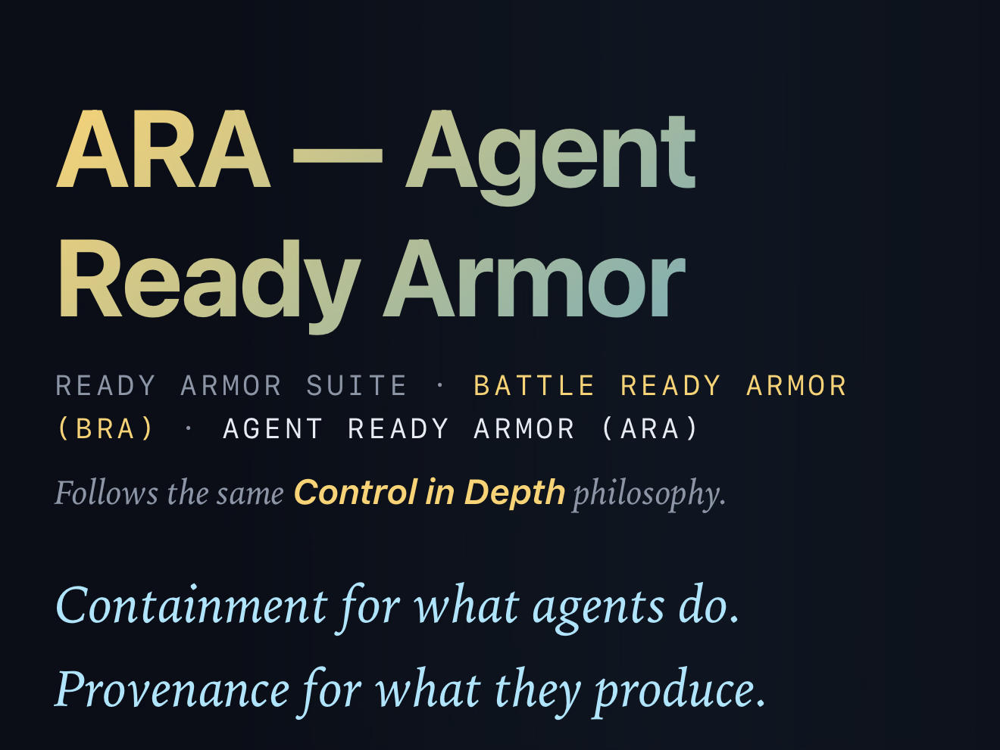</a>

<h3><a href="https://github.com/GainSec/AgentReadyArmor-Teaser">AgentReadyArmor — Teaser</a></h3>
A public preview of an agent runtime substrate focused on capability containment, evidence provenance, and auditable operator control.
</td>
</tr>
<tr>
<td width="50%" valign="top">

<h3><a href="https://github.com/GainSec/ArcticBase">ArcticBase</a></h3>
A self-hosted workbench for agent approvals, runbooks, files, review artifacts, task state, and auditable out-of-band collaboration.
</td>
<td width="50%" valign="top">

<h3><a href="https://github.com/GainSec/BirdShot">BirdShot</a></h3>
An offline-first offensive framework for authorized Flock Safety security assessments and penetration testing.
</td>
</tr>
<tr>
<td width="50%" valign="top">

<h3><a href="https://github.com/pragma-org/dwarf">DWARF</a></h3>
Cardano and Amaru fuzzing and adversarial testing across serialization, mini-protocol, runtime, resource, and consensus surfaces, with replayable evidence and deterministic-simulation integration.
</td>
<td width="50%" valign="top">

<h3><a href="https://github.com/GainSec/Super-Awesome-AI-Driver">Super Awesome AI Driver</a></h3>
A reverse-engineered camera-car dashboard and agent API that gives a human or authorized agent live video, two-way audio, and motion control.
</td>
</tr>
</table>

## Project Card Archive

<!-- AUTO:CARDS START -->

<strong>Vulnerability / Security Research · 16 projects</strong>

<h4>Connected Public Safety and Anti-Crime Technology</h4>

<a href="https://github.com/GainSec/anti-crime-ecosystem-research">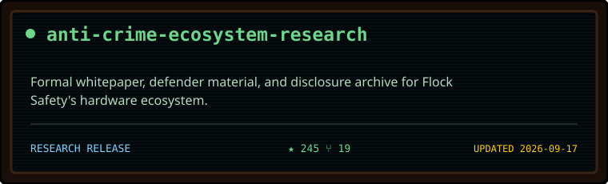</a>

<a href="https://github.com/GainSec/BirdShot">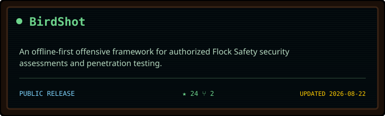</a>

<a href="https://github.com/GainSec/Flock-Safety-Trap-Shooter-Sniffer-Alarm">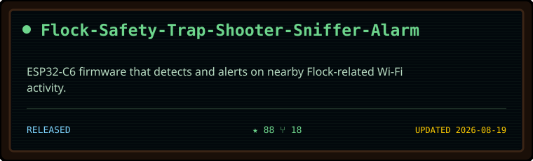</a>

<a href="https://github.com/GainSec/onvif-enum">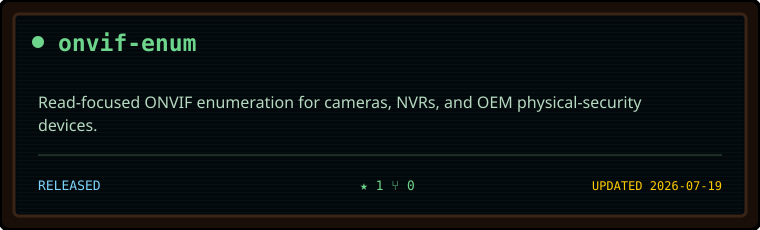</a>

<a href="https://github.com/GainSec/Uniview-LAPI-Research-Toolkit">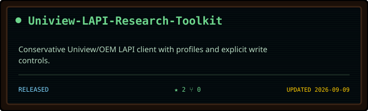</a>

<a href="https://github.com/GainSec/DigitalAlly-ThermoVu-Uniview-Security-Research">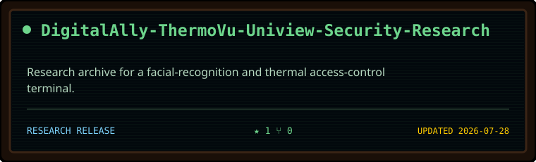</a>

<a href="https://github.com/GainSec/verkada-verkracked-alarm-hub-local-framework">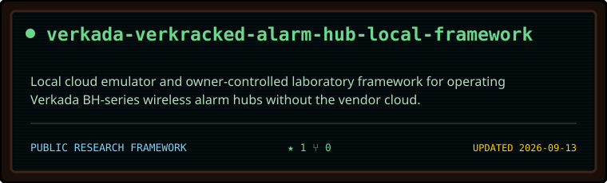</a>

<a href="https://github.com/GainSec/verkada-verkracked-subghz-framework">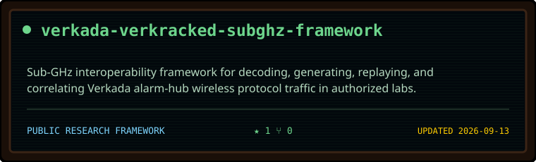</a>

<a href="https://github.com/GainSec/CVE-2017-16744-and-CVE-2017-16748-Tridium-Niagara">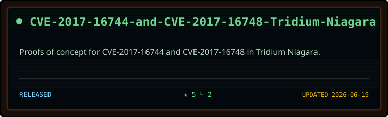</a>

<a href="https://github.com/GainSec/flock-safety-falcon-sparrow-alpr-edl-firehose">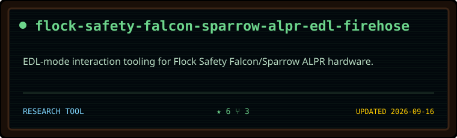</a>

<h4>Vulnerability Disclosures</h4>

<a href="https://github.com/GainSec/macos-printer-simulator-security-research">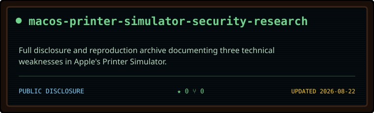</a>

<a href="https://github.com/GainSec/AOL-Desktop-Gold-Security-Research">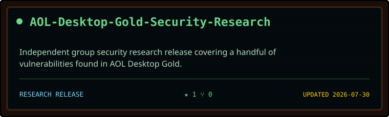</a>

<h4>Automotive + V2X Security</h4>

<a href="https://github.com/GainSec/3rdParty-Carplay-AndroidAuto-Dongle-Security-Research">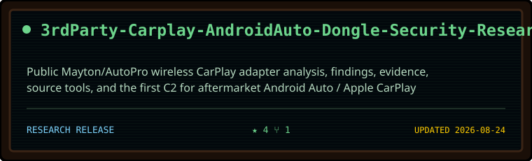</a>

<a href="https://github.com/GainSec/Wireless-Attack-Vectors-Against-Automobiles">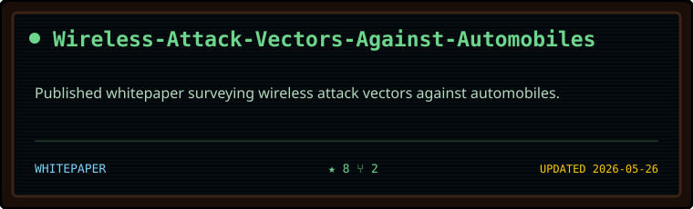</a>

<h4>Hardware + Embedded Security</h4>

<a href="https://github.com/GainSec/Little-Tikes-DreamProjector-Reverse-Engineering">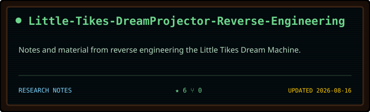</a>

<h4>Research Companion Material</h4>

<a href="https://github.com/GainSec/Phrack-72-Raw-Output-V2X">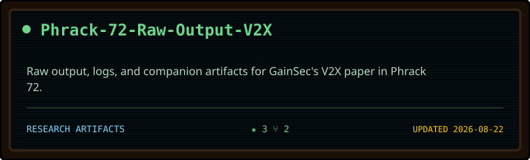</a>

<strong>Technical Walkthroughs · 5 projects</strong>

<h4>Tutorials + Build Guides</h4>

<a href="https://gist.github.com/J-GainSec/abc563d2bc0063530711e4342edf7537">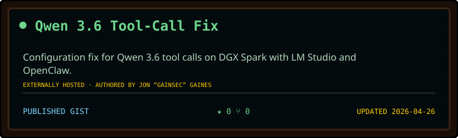</a>

<a href="https://github.com/GainSec/M5NanoC6-Zigbee-Sniffer">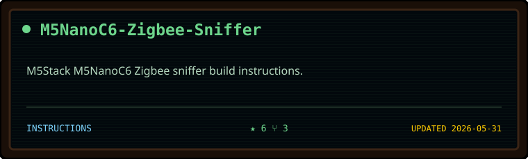</a>

<a href="https://github.com/GainSec/CloudGoatTutorial">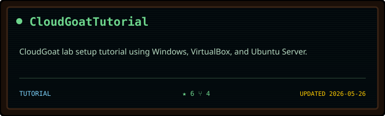</a>

<h4>Lectures + Educational Material</h4>

<a href="https://github.com/GainSec/Silk-Road-Lecture">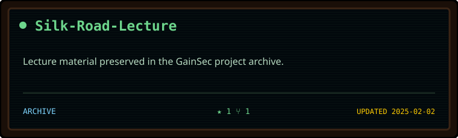</a>

<h4>Workflow Guides</h4>

<a href="https://github.com/GainSec/n8n-workflow-whisper-server">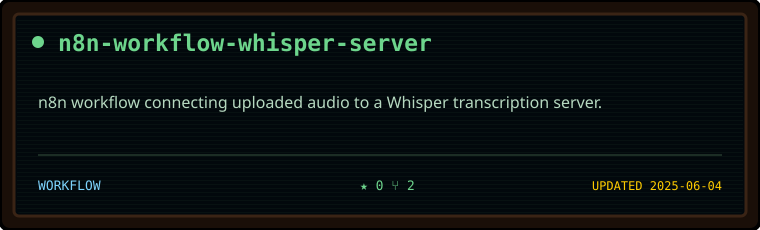</a>

<strong>Offensive Tooling · 16 projects</strong>

<h4>Fuzzing + Adversarial Testing</h4>

<a href="https://github.com/pragma-org/dwarf">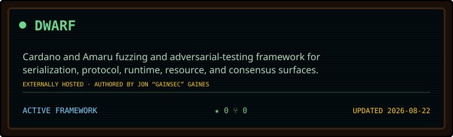</a>

<h4>Reconnaissance + Enumeration</h4>

<a href="https://github.com/GainSec/crt.sh-OSX">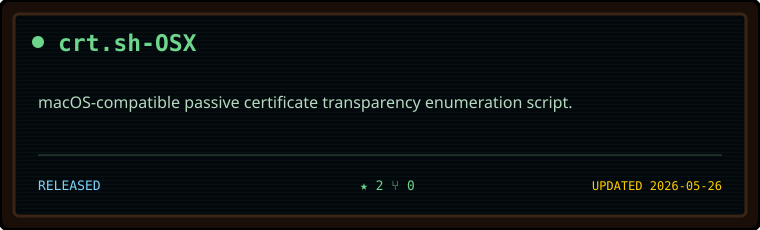</a>

<h4>OSINT</h4>

<a href="https://github.com/GainSec/LeakScope">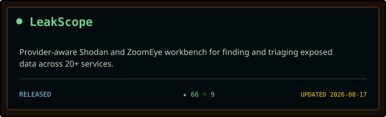</a>

<a href="https://github.com/GainSec/Dorker">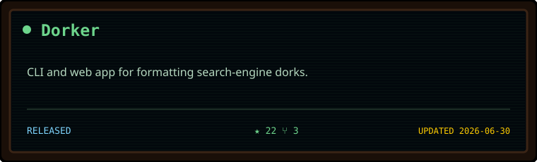</a>

<a href="https://github.com/GainSec/FOSINT">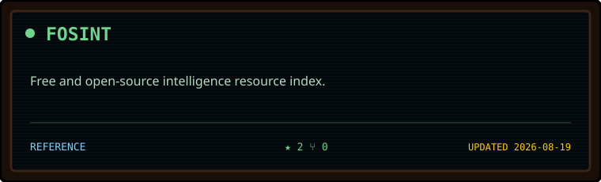</a>

<a href="https://github.com/GainSec/Base-Google-Dorks">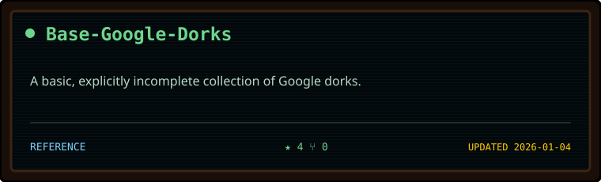</a>

<h4>Assessment Workflow</h4>

<a href="https://github.com/GainSec/GoldenNuggets-1">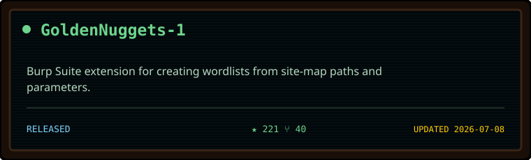</a>

<a href="https://github.com/GainSec/TreeHouse-Wordlists">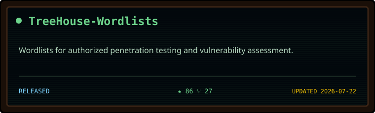</a>

<a href="https://github.com/GainSec/Hackers-LunchBox">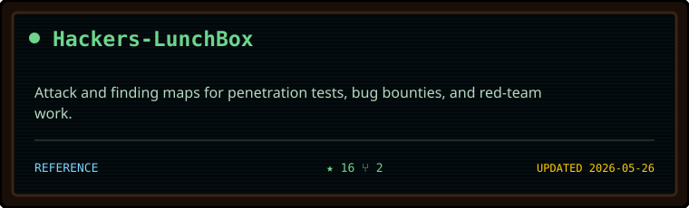</a>

<a href="https://github.com/GainSec/Mac-OSX-Application-Fingerprint-And-Security-Tool">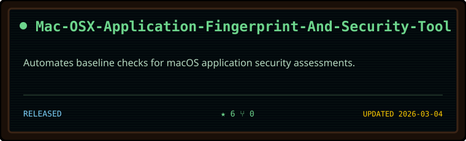</a>

<a href="https://github.com/GainSec/Quick-Engagement-Directory-Maker">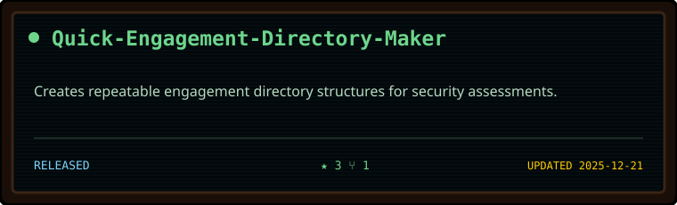</a>

<h4>Wireless + Device Tooling</h4>

<a href="https://github.com/GainSec/gainsec-in-the-middle">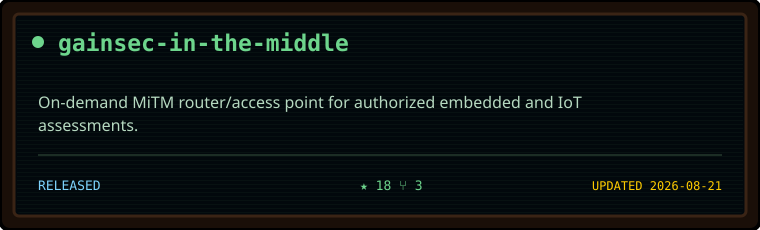</a>

<a href="https://github.com/GainSec/Weaponized-Mousejack-Keysniff">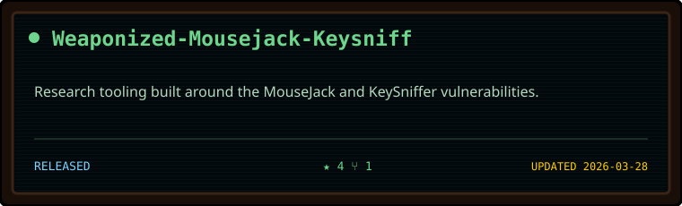</a>

<h4>Payload + Bypass Research</h4>

<a href="https://github.com/GainSec/RTLOify">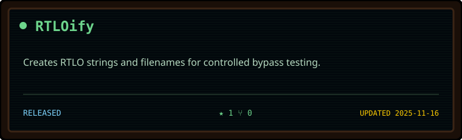</a>

<h4>Legacy Tooling</h4>

<a href="https://github.com/GainSec/vncpwn">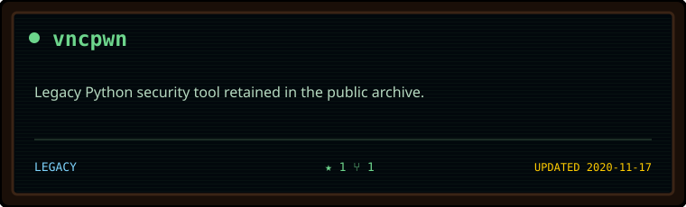</a>

<a href="https://github.com/GainSec/LeakLooker-X---2022">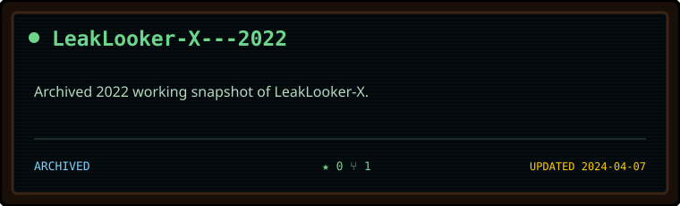</a>

<strong>Open / Public Source Projects · 17 projects</strong>

<h4>Hardware + Embedded</h4>

<a href="https://github.com/GainSec/AutoProber">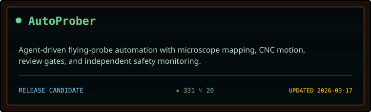</a>

<a href="https://github.com/GainSec/RapidPower-RoboDog">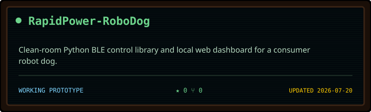</a>

<a href="https://github.com/GainSec/Super-Awesome-AI-Driver">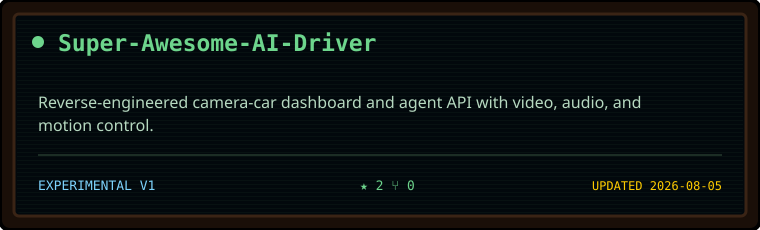</a>

<h4>RF + Wireless</h4>

<a href="https://github.com/GainSec/Tree-House-Defense-System-TDS">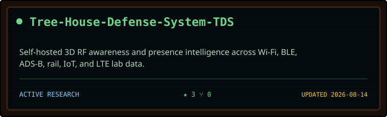</a>

<a href="https://github.com/GainSec/M5Stack-Core2-PaxCounter-WiFi-Bluetooth-Monitor">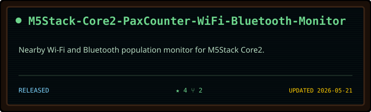</a>

<h4>LLM / ML / AI / Agents</h4>

<a href="https://github.com/GainSec/ArcticBase">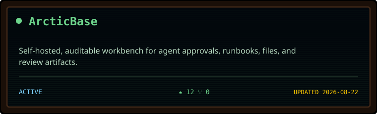</a>

<a href="https://github.com/GainSec/BattleReadyArmor-Slim">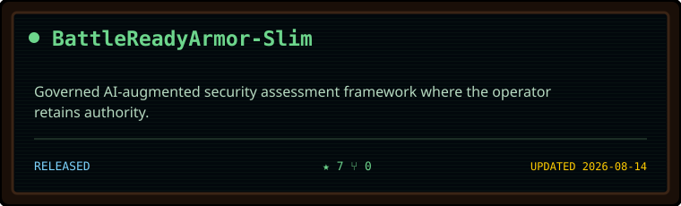</a>

<a href="https://github.com/GainSec/battlereadyarmor-pilot">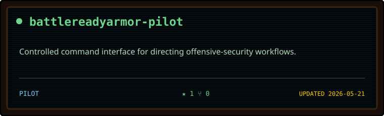</a>

<a href="https://github.com/GainSec/MacOS-ImagePlayground-Improved">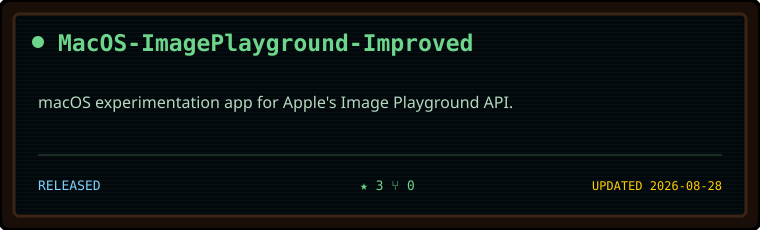</a>

<a href="https://github.com/GainSec/AgentReadyArmor-Teaser">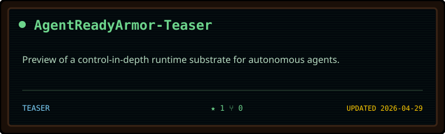</a>

<a href="https://github.com/GainSec/tensorflow-generic-harness">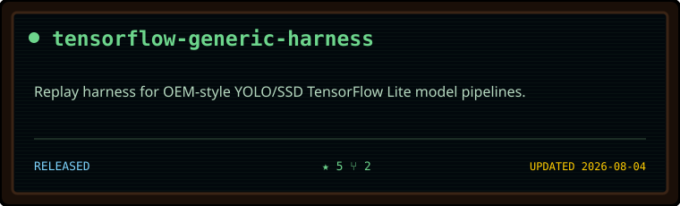</a>

<h4>Applications + Utilities</h4>

<h4>Data + Visualization</h4>

<strong>Everything Else · 1 project</strong>

<h4>Experiments</h4>

<!-- AUTO:CARDS END -->

## Project Constellation

<!-- AUTO:CONSTELLATION START -->

<strong>Vulnerability / Security Research · 16 projects</strong>

<strong>Technical Walkthroughs · 5 projects</strong>

<strong>Offensive Tooling · 16 projects</strong>

<strong>Open / Public Source Projects · 17 projects</strong>

<strong>Everything Else · 1 project</strong>

<!-- AUTO:CONSTELLATION END -->

## Complete Atlas

<strong>Open the text index of every original GainSec repository</strong>

<!-- AUTO:INDEX START -->
### Vulnerability / Security Research
#### Connected Public Safety and Anti-Crime Technology
- [anti-crime-ecosystem-research](https://github.com/GainSec/anti-crime-ecosystem-research) — Formal whitepaper, defender material, and disclosure archive for Flock Safety's hardware ecosystem.
- [BirdShot](https://github.com/GainSec/BirdShot) — An offline-first offensive framework for authorized Flock Safety security assessments and penetration testing.
- [Flock-Safety-Trap-Shooter-Sniffer-Alarm](https://github.com/GainSec/Flock-Safety-Trap-Shooter-Sniffer-Alarm) — ESP32-C6 firmware that detects and alerts on nearby Flock-related Wi-Fi activity.
- [onvif-enum](https://github.com/GainSec/onvif-enum) — Read-focused ONVIF enumeration for cameras, NVRs, and OEM physical-security devices.
- [Uniview-LAPI-Research-Toolkit](https://github.com/GainSec/Uniview-LAPI-Research-Toolkit) — Conservative Uniview/OEM LAPI client with profiles and explicit write controls.
- [DigitalAlly-ThermoVu-Uniview-Security-Research](https://github.com/GainSec/DigitalAlly-ThermoVu-Uniview-Security-Research) — Research archive for a facial-recognition and thermal access-control terminal.
- [verkada-verkracked-alarm-hub-local-framework](https://github.com/GainSec/verkada-verkracked-alarm-hub-local-framework) — Local cloud emulator and owner-controlled laboratory framework for operating Verkada BH-series wireless alarm hubs without the vendor cloud.
- [verkada-verkracked-subghz-framework](https://github.com/GainSec/verkada-verkracked-subghz-framework) — Sub-GHz interoperability framework for decoding, generating, replaying, and correlating Verkada alarm-hub wireless protocol traffic in authorized labs.
- [CVE-2017-16744-and-CVE-2017-16748-Tridium-Niagara](https://github.com/GainSec/CVE-2017-16744-and-CVE-2017-16748-Tridium-Niagara) — Proofs of concept for CVE-2017-16744 and CVE-2017-16748 in Tridium Niagara.
- [flock-safety-falcon-sparrow-alpr-edl-firehose](https://github.com/GainSec/flock-safety-falcon-sparrow-alpr-edl-firehose) — EDL-mode interaction tooling for Flock Safety Falcon/Sparrow ALPR hardware.

#### Vulnerability Disclosures
- [macos-printer-simulator-security-research](https://github.com/GainSec/macos-printer-simulator-security-research) — Full disclosure and reproduction archive documenting three technical weaknesses in Apple's Printer Simulator.
- [AOL-Desktop-Gold-Security-Research](https://github.com/GainSec/AOL-Desktop-Gold-Security-Research) — Independent group security research release covering a handful of vulnerabilities found in AOL Desktop Gold.

#### Automotive + V2X Security
- [3rdParty-Carplay-AndroidAuto-Dongle-Security-Research](https://github.com/GainSec/3rdParty-Carplay-AndroidAuto-Dongle-Security-Research) — Public Mayton/AutoPro wireless CarPlay adapter analysis, findings, evidence, source tools, and the first C2 for aftermarket Android Auto / Apple CarPlay dongles.
- [Wireless-Attack-Vectors-Against-Automobiles](https://github.com/GainSec/Wireless-Attack-Vectors-Against-Automobiles) — Published whitepaper surveying wireless attack vectors against automobiles.

#### Hardware + Embedded Security
- [Little-Tikes-DreamProjector-Reverse-Engineering](https://github.com/GainSec/Little-Tikes-DreamProjector-Reverse-Engineering) — Notes and material from reverse engineering the Little Tikes Dream Machine.

#### Research Companion Material
- [Phrack-72-Raw-Output-V2X](https://github.com/GainSec/Phrack-72-Raw-Output-V2X) — Raw output, logs, and companion artifacts for GainSec's V2X paper in Phrack 72.

### Technical Walkthroughs
#### Tutorials + Build Guides
- [Qwen 3.6 Tool-Call Fix](https://gist.github.com/J-GainSec/abc563d2bc0063530711e4342edf7537) — Configuration fix for Qwen 3.6 tool calls on DGX Spark with LM Studio and OpenClaw.
- [M5NanoC6-Zigbee-Sniffer](https://github.com/GainSec/M5NanoC6-Zigbee-Sniffer) — M5Stack M5NanoC6 Zigbee sniffer build instructions.
- [CloudGoatTutorial](https://github.com/GainSec/CloudGoatTutorial) — CloudGoat lab setup tutorial using Windows, VirtualBox, and Ubuntu Server.

#### Lectures + Educational Material
- [Silk-Road-Lecture](https://github.com/GainSec/Silk-Road-Lecture) — Lecture material preserved in the GainSec project archive.

#### Workflow Guides
- [n8n-workflow-whisper-server](https://github.com/GainSec/n8n-workflow-whisper-server) — n8n workflow connecting uploaded audio to a Whisper transcription server.

### Offensive Tooling
#### Fuzzing + Adversarial Testing
- [DWARF](https://github.com/pragma-org/dwarf) — Cardano and Amaru fuzzing and adversarial-testing framework for serialization, protocol, runtime, resource, and consensus surfaces.

#### Reconnaissance + Enumeration
- [crt.sh-OSX](https://github.com/GainSec/crt.sh-OSX) — macOS-compatible passive certificate transparency enumeration script.

#### OSINT
- [LeakScope](https://github.com/GainSec/LeakScope) — Provider-aware Shodan and ZoomEye workbench for finding and triaging exposed data across 20+ services.
- [Dorker](https://github.com/GainSec/Dorker) — CLI and web app for formatting search-engine dorks.
- [FOSINT](https://github.com/GainSec/FOSINT) — Free and open-source intelligence resource index.
- [Base-Google-Dorks](https://github.com/GainSec/Base-Google-Dorks) — A basic, explicitly incomplete collection of Google dorks.

#### Assessment Workflow
- [GoldenNuggets-1](https://github.com/GainSec/GoldenNuggets-1) — Burp Suite extension for creating wordlists from site-map paths and parameters.
- [TreeHouse-Wordlists](https://github.com/GainSec/TreeHouse-Wordlists) — Wordlists for authorized penetration testing and vulnerability assessment.
- [Hackers-LunchBox](https://github.com/GainSec/Hackers-LunchBox) — Attack and finding maps for penetration tests, bug bounties, and red-team work.
- [Mac-OSX-Application-Fingerprint-And-Security-Tool](https://github.com/GainSec/Mac-OSX-Application-Fingerprint-And-Security-Tool) — Automates baseline checks for macOS application security assessments.
- [Quick-Engagement-Directory-Maker](https://github.com/GainSec/Quick-Engagement-Directory-Maker) — Creates repeatable engagement directory structures for security assessments.

#### Wireless + Device Tooling
- [gainsec-in-the-middle](https://github.com/GainSec/gainsec-in-the-middle) — On-demand MiTM router/access point for authorized embedded and IoT assessments.
- [Weaponized-Mousejack-Keysniff](https://github.com/GainSec/Weaponized-Mousejack-Keysniff) — Research tooling built around the MouseJack and KeySniffer vulnerabilities.

#### Payload + Bypass Research
- [RTLOify](https://github.com/GainSec/RTLOify) — Creates RTLO strings and filenames for controlled bypass testing.

#### Legacy Tooling
- [vncpwn](https://github.com/GainSec/vncpwn) — Legacy Python security tool retained in the public archive.
- [LeakLooker-X---2022](https://github.com/GainSec/LeakLooker-X---2022) — Archived 2022 working snapshot of LeakLooker-X.

### Open / Public Source Projects
#### Hardware + Embedded
- [AutoProber](https://github.com/GainSec/AutoProber) — Agent-driven flying-probe automation with microscope mapping, CNC motion, review gates, and independent safety monitoring.
- [RapidPower-RoboDog](https://github.com/GainSec/RapidPower-RoboDog) — Clean-room Python BLE control library and local web dashboard for a consumer robot dog.
- [Super-Awesome-AI-Driver](https://github.com/GainSec/Super-Awesome-AI-Driver) — Reverse-engineered camera-car dashboard and agent API with video, audio, and motion control.

#### RF + Wireless
- [Tree-House-Defense-System-TDS](https://github.com/GainSec/Tree-House-Defense-System-TDS) — Self-hosted 3D RF awareness and presence intelligence across Wi-Fi, BLE, ADS-B, rail, IoT, and LTE lab data.
- [M5Stack-Core2-PaxCounter-WiFi-Bluetooth-Monitor](https://github.com/GainSec/M5Stack-Core2-PaxCounter-WiFi-Bluetooth-Monitor) — Nearby Wi-Fi and Bluetooth population monitor for M5Stack Core2.

#### LLM / ML / AI / Agents
- [ArcticBase](https://github.com/GainSec/ArcticBase) — Self-hosted, auditable workbench for agent approvals, runbooks, files, and review artifacts.
- [BattleReadyArmor-Slim](https://github.com/GainSec/BattleReadyArmor-Slim) — Governed AI-augmented security assessment framework where the operator retains authority.
- [battlereadyarmor-pilot](https://github.com/GainSec/battlereadyarmor-pilot) — Controlled command interface for directing offensive-security workflows.
- [MacOS-ImagePlayground-Improved](https://github.com/GainSec/MacOS-ImagePlayground-Improved) — macOS experimentation app for Apple's Image Playground API.
- [AgentReadyArmor-Teaser](https://github.com/GainSec/AgentReadyArmor-Teaser) — Preview of a control-in-depth runtime substrate for autonomous agents.
- [tensorflow-generic-harness](https://github.com/GainSec/tensorflow-generic-harness) — Replay harness for OEM-style YOLO/SSD TensorFlow Lite model pipelines.
- [BattleReadyArmor-PublicPreview](https://github.com/GainSec/BattleReadyArmor-PublicPreview) — Public architecture preview for governed, privacy-preserving agentic assessments.
- [GainSec-Local-AI-Stack](https://github.com/GainSec/GainSec-Local-AI-Stack) — Scripts, workflows, and notes from local AI-stack prototyping.
- [MacOS-AppleIntelligence-Harness](https://github.com/GainSec/MacOS-AppleIntelligence-Harness) — Local macOS harness for prompts, pipelines, and consistency experiments with Apple Foundation Models.

#### Applications + Utilities
- [PineapplePager-Themer](https://github.com/GainSec/PineapplePager-Themer) — Visual theme editor and exporter for the Hak5 WiFi Pineapple Pager.
- [unicode-secret-message](https://github.com/GainSec/unicode-secret-message) — Small interface built during research into RTLO, PDF, and other Unicode characters.

#### Data + Visualization
- [SectorMap](https://github.com/GainSec/SectorMap) — Offline-first self-hosted dataset browser with a galaxy-style archive interface.

### Everything Else
#### Experiments
- [IG-Clone-Tracker](https://github.com/GainSec/IG-Clone-Tracker) — Instagram clone for lab research, prototyping, and tracking experiments.
<!-- AUTO:INDEX END -->

> [!CAUTION]
> This archive contains dual-use security research and tools. Use them only in owned or explicitly authorized environments, and follow each project’s safety and disclosure boundaries.
